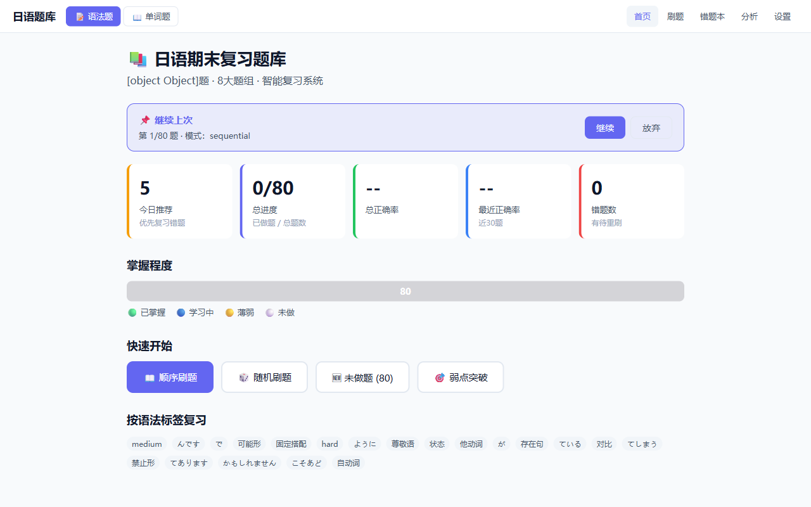
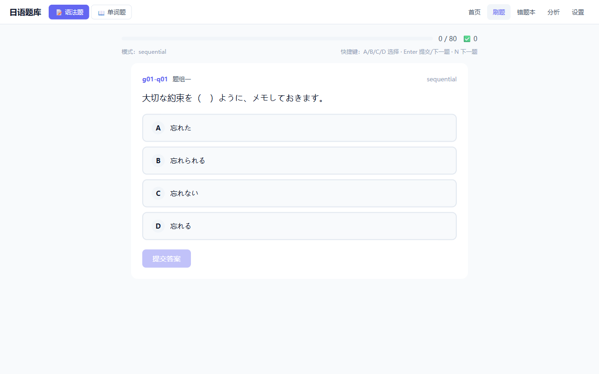
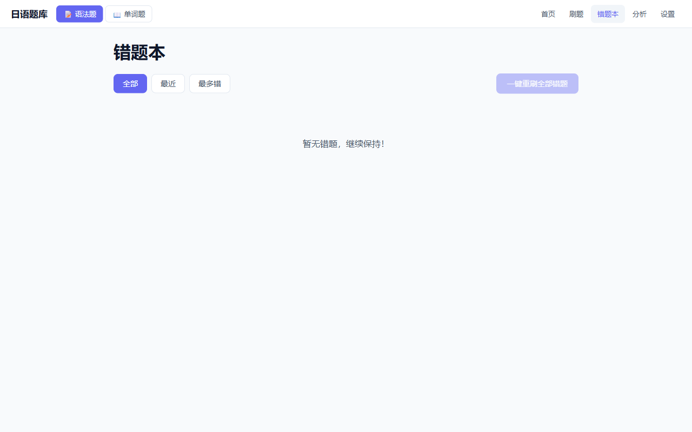
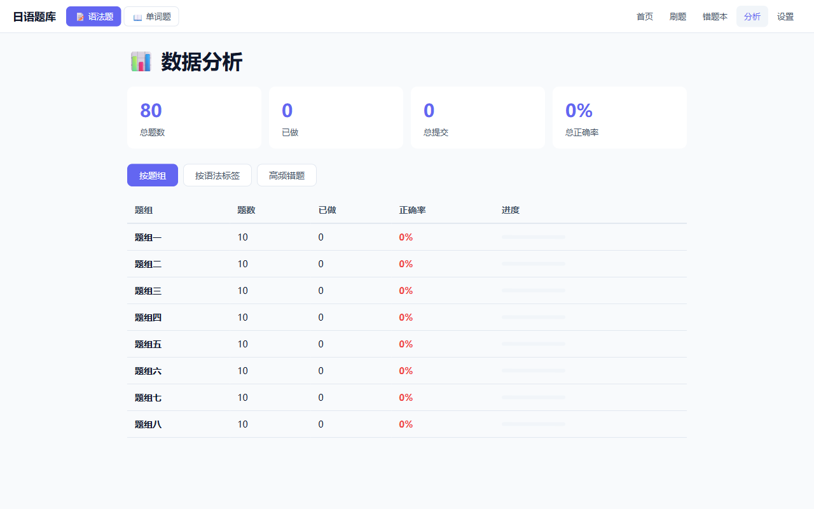

# DLUT 多学科复习题库 · Multi-Subject Quiz Platform

[](https://github.com/tianxingleo/dlut-nihongo-quiz/actions/workflows/ci.yml)
[](https://github.com/tianxingleo/dlut-nihongo-quiz/actions/workflows/deploy.yml)
[](LICENSE)
[](https://vuejs.org/)
[](#-学科范围)

> 一句话：大连理工大学本科生期末复习用的 Web App，覆盖日语、中国近现代史、党史、军事理论共 5 个学科、6,000+ 道题。起源是「大家的日语」第 26-36 课复习题库，后扩展到多学科。

## ✨ 特性

- **5 大学科**：日语语法 / 日语单词 / 中国近现代史 / 党史 / 军事理论，共 **6,104 题**
- **多题型**：单选、多选（多答案）、判断 —— 历史/党史/军理共 1,412 道多选题
- **错题解析**：每题都带详细解析 + 错选项注释，知道为什么错
- **刷题模式**：随机出题、顺序刷、按课次/章节、错题重做、弱点专练
- **错题本**：自动收集，按复习调度算法提醒重做
- **统计分析**：按学科 / 课次 / 标签统计正确率，可视化学习进度
- **离线优先**：IndexedDB 存储，关闭浏览器再打开进度还在
- **移动端友好**：响应式布局，手机刷题体验流畅
- **MD 驱动**：题库源是 Markdown，parser 自动生成 JSON，PR 就能加题

## 📚 学科范围

| 学科            |      题数 |    多选题 | 来源                      | 用途            |
| --------------- | --------: | --------: | ------------------------- | --------------- |
| 🇯🇵 日语语法     |        99 |         0 | 《大家的日语》第 26-36 课 | 大一下学期期末  |
| 🇯🇵 日语单词     |       686 |         0 | 同上                      | 汉字 / 假名互选 |
| 🇨🇳 中国近现代史 |     2,921 |       838 | 课堂题库 + 纲要 + 习题集  | 近代史纲要期末  |
| 🚩 党史         |     1,661 |       532 | 党史题库完整版            | 思政课复习      |
| 🎖️ 军事理论     |       737 |        42 | 军理题库整理版            | 军训理论考核    |
| **合计**        | **6,104** | **1,412** | —                         | —               |

## 🎯 在线使用

**👉 https://tianxingleo.top/dlut-nihongo-quiz/**

无需安装，打开就刷。首次加载会拉题库（约 250 KB JSON），之后离线可用。

## 📸 截图

| 首页                                                           | 刷题                                                           |
| -------------------------------------------------------------- | -------------------------------------------------------------- |
|  |  |

| 错题本                                                            | 分析                                                               |
| ----------------------------------------------------------------- | ------------------------------------------------------------------ |
|  |  |

## 🚀 快速开始

需要 Node.js 18+（CI 用 Node 24）。

```bash
git clone https://github.com/tianxingleo/dlut-nihongo-quiz.git
cd dlut-nihongo-quiz
npm install
npm run dev          # http://localhost:5173/
```

常用脚本：

| 命令                     | 作用                                                          |
| ------------------------ | ------------------------------------------------------------- |
| `npm run dev`            | 启动开发服务器                                                |
| `npm run build`          | 生产构建（`base=/dlut-nihongo-quiz/`，含 `vue-tsc` 类型检查） |
| `npm run preview`        | 本地预览生产构建                                              |
| `npm run test`           | 单元测试（vitest）                                            |
| `npm run parse:all`      | 一次性跑全部 5 个 parser                                      |
| `npm run parse:grammar`  | 语法 md → JSON                                                |
| `npm run parse:words`    | 单词 md → JSON                                                |
| `npm run parse:history`  | 历史 md → JSON                                                |
| `npm run parse:party`    | 党史 md → JSON                                                |
| `npm run parse:military` | 军事 md → JSON                                                |
| `npm run audit:banks`    | 题库 schema + 内部去重检查                                    |
| `npm run format`         | Prettier 自动格式化                                           |

> **不要手改 `public/*.json`** —— 它们是 parser 生成的。源在 `data/raw/` 下的 Markdown。

## 📖 深入文档

| 文档                                  | 内容                                                       |
| ------------------------------------- | ---------------------------------------------------------- |
| [项目结构](docs/project-structure.md) | 完整目录树、数据流、各模块职责                             |
| [题库维护](docs/question-bank.md)     | 加题改题流程、Markdown 格式、多选/判断题写法、新增学科步骤 |
| [部署](docs/deployment.md)            | GitHub Pages + Actions、自定义域名、本地预览生产构建       |
| [贡献指南](CONTRIBUTING.md)           | Fork/PR 流程、代码风格、Commit 规范                        |

## 🤝 贡献

欢迎提 Issue 报 bug、建议功能或加题。

- 🐛 报 bug / 💡 建议功能：[开 Issue](https://github.com/tianxingleo/dlut-nihongo-quiz/issues/new/choose)
- ➕ 加题 / ✏️ 改代码：fork → 改 → 提 PR（详见 [CONTRIBUTING.md](CONTRIBUTING.md)）

## ⚠️ 版权与免责声明

- **代码**：[Apache License 2.0](LICENSE)。
- **题目内容**：题目来源于《大家的日语》（スリーエーネットワーク出版）、大连理工大学课堂复习资料、公开题库等，**版权归原著作权人所有**。本项目仅出于**学习交流与个人复习目的**使用（fair use），不用于任何商业用途。
- **侵权处理**：若原著作权人认为本项目侵犯其权益，请通过 [Issues](https://github.com/tianxingleo/dlut-nihongo-quiz/issues) 联系仓库所有者，确认后将在 48 小时内删除相关内容。
- **学术诚信**：本项目用于**期末复习**，不鼓励、不协助任何形式的考试作弊。

## 🙏 Acknowledgments

- 大连理工大学国际信息与软件学院、马克思主义学院、军事教研室的教学老师们
- 《大家的日语》教材编写组
- 所有为本项目贡献过题目与代码的同学

---

## English Summary

A Vue 3 + Vite + TypeScript + Dexie single-page quiz app built for final-exam review at Dalian University of Technology (DLUT). Originally a Japanese-review tool for lessons 26–36 of《大家的日语》(Minna no Nihongo), it now spans **five subjects and 6,104 questions**:

- Japanese grammar (99) and vocabulary (686)
- Modern Chinese history (2,921, including 838 multi-answer)
- CPC party history (1,661, including 532 multi-answer)
- Military theory (737, including 42 multi-answer)

**Features:** single/multi/judgement question types, per-question explanations with wrong-option annotations, wrong-answer book with spaced-repetition scheduling, statistics by subject/lesson/tag, offline-first via IndexedDB, mobile-friendly responsive UI.

**Live:** https://tianxingleo.top/dlut-nihongo-quiz/

**Run locally:** `git clone`, `npm install`, `npm run dev` (Node 18+, CI uses 24).

**Question bank:** Markdown is the source of truth under `data/raw/`; five `npm run parse:*` scripts generate the JSON consumed at runtime. Never edit `public/*.json` by hand.

**License:** Apache-2.0 for code. Question content is copyrighted by the original publishers and used here for educational review only.

**Contributions:** Issues and PRs welcome — see [`CONTRIBUTING.md`](CONTRIBUTING.md) and [`docs/question-bank.md`](docs/question-bank.md).
