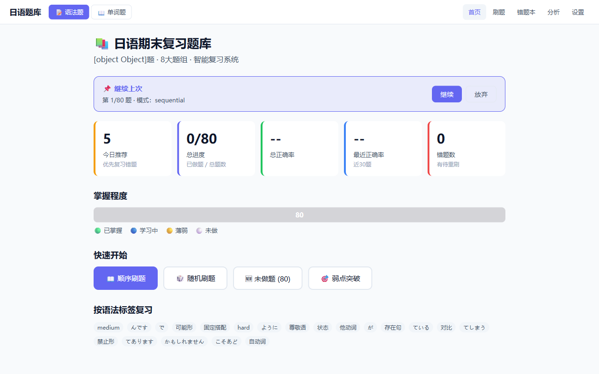
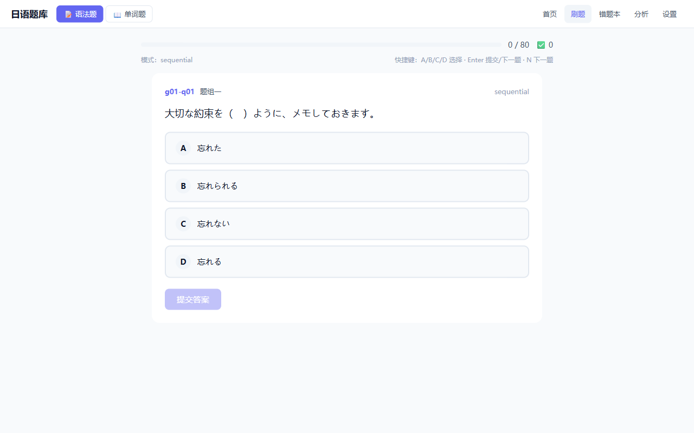
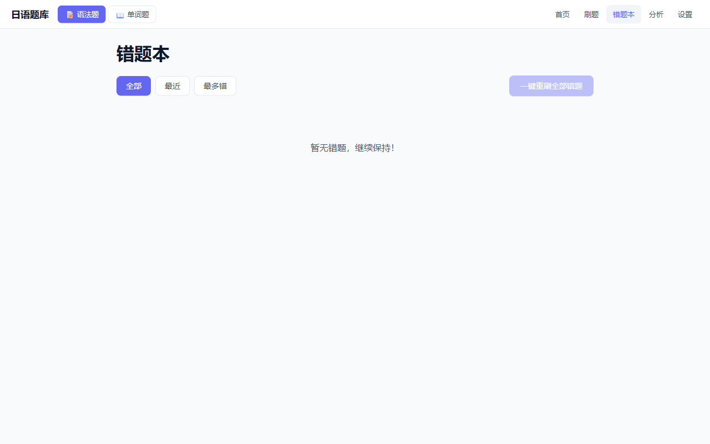
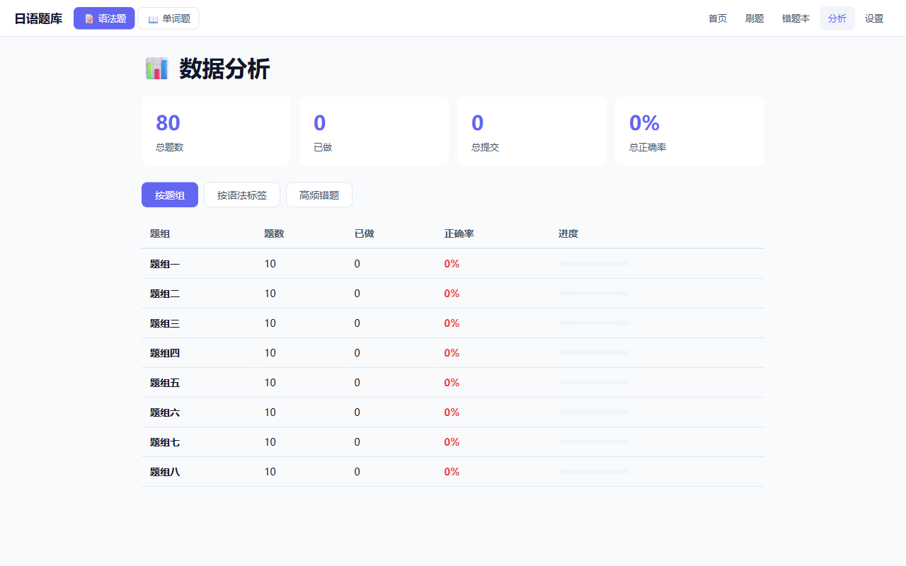

# DLUT 多学科复习题库

[](https://github.com/tianxingleo/dlut-nihongo-quiz/actions/workflows/ci.yml)
[](https://github.com/tianxingleo/dlut-nihongo-quiz/actions/workflows/deploy.yml)
[](LICENSE)
[](https://vuejs.org/)

大连理工大学本科生期末复习用的 Web App，覆盖综合日语、中国近现代史、党史、军事理论、计算机组成、马克思主义原理共 6 个学科、7,000+ 道题。最早是「大家的日语」第 26-36 课复习题库，后扩展到多学科。

## 特性

- 6 大学科，共 7,064 题：综合日语2（单词 + 语法） / 中国近现代史 / 党史 / 军事理论 / 计算机组成 / 马克思主义原理
- 多题型：单选、多选、判断、填空 —— 历史 / 党史 / 军理共 1,482 道多选题、851 道判断题、385 道填空题
- 每题都带详细解析 + 错选项注释，知道为什么错
- 刷题模式：随机出题、顺序刷、按课次/章节、错题重做、弱点专练
- 错题本：自动收集，按复习调度算法提醒重做
- 统计分析：按学科 / 课次 / 标签统计正确率，可视化学习进度
- 离线优先：IndexedDB 存储，关闭浏览器再打开进度还在
- 移动端友好：响应式布局，手机刷题体验流畅
- MD 驱动：题库源是 Markdown / 结构化 JSON，parser 自动生成应用 JSON，PR 就能加题

## 学科范围

| 学科           |      题数 |      多选 |    判断 |    填空 | 来源                            | 用途           |
| -------------- | --------: | --------: | ------: | ------: | ------------------------------- | -------------- |
| 综合日语2      |       963 |         0 |       0 |       0 | 单词 686 + 语法 277             | 大一下学期期末 |
| 中国近现代史   |     2,985 |       851 |     755 |     161 | 课堂题库 + 纲要 + 习题集        | 近代史纲要期末 |
| 党史           |     1,613 |       515 |       0 |       0 | 党史题库完整版                  | 思政课复习     |
| 军事理论       |       753 |       116 |      96 |     224 | 军理题库整理版                  | 军训理论考核   |
| 计算机组成     |       240 |         0 |      18 |      47 | 5 份试卷，答案经生成与校订      | 计算机组成复习 |
| 马克思主义原理 |       510 |       138 |       5 |      31 | 机考真题 + 6 份试卷（PDF 导入） | 马原期末       |
| **合计**       | **7,064** | **1,620** | **874** | **463** | —                               | —              |

综合日语2 包含四个子库：单词（w26–w36）、学习通 99 题（g01–g10）、2021 年真题 79 题（g11）、2024 年真题 99 题（g21–g28）。

计算机组成（软国际）共 240 题（5 份试卷），参考答案由 StepFun `step-3.7-flash` 生成并经复核，非官方答案。

马克思主义原理共 510 题（机考真题 345 题 + 6 份试卷），来源是 PDF 试卷扫描件：
由 [`pdf-ocr/`](pdf-ocr/README.md) 工具做「双路 OCR → 比对提取 → 答案贴回 → 契约校验」后上站，
用法见 [PDF 试卷导入工具](docs/pdf-ocr-import-guide.md)。答案与解析为 OCR + AI 校对产物，**非官方答案**，
带 `⚠ 待核对` 的题在站上仍会显示（并标出来源）。

## 在线使用

**https://tianxingleo.top/dlut-nihongo-quiz/**

无需安装。首次加载会拉题库（约 250 KB JSON），之后离线可用。

## 截图

| 首页                                                           | 刷题                                                           |
| -------------------------------------------------------------- | -------------------------------------------------------------- |
|  |  |

| 错题本                                                            | 分析                                                               |
| ----------------------------------------------------------------- | ------------------------------------------------------------------ |
|  |  |

## 快速开始

推荐 Node.js 24（与 CI 一致；Vite 8 要求 Node.js 20.19+ 或 22.12+）。

```bash
git clone https://github.com/tianxingleo/dlut-nihongo-quiz.git
cd dlut-nihongo-quiz
npm install
npm run dev          # http://localhost:5173/
```

常用脚本：

| 命令                      | 作用                                                          |
| ------------------------- | ------------------------------------------------------------- |
| `npm run dev`             | 启动开发服务器                                                |
| `npm run build`           | 生产构建（`base=/dlut-nihongo-quiz/`，含 `vue-tsc` 类型检查） |
| `npm run preview`         | 本地预览生产构建                                              |
| `npm run test`            | Vitest 测试 + 计算机题库回归检查                              |
| `npm run parse:all`       | 一次性跑全部 parser                                           |
| `npm run merge:japanese2` | 合并已生成的语法、单词 JSON 为综合日语2题库                   |
| `npm run parse:history`   | 历史 md → JSON                                                |
| `npm run parse:party`     | 党史 md → JSON                                                |
| `npm run parse:military`  | 军事 md → JSON                                                |
| `npm run parse:computer`  | 从结构化源文件生成计算机组成题库                              |
| `npm run test:computer`   | 检查计算机题库答案、来源覆盖与已知勘误                        |
| `npm run generate:meta`   | 更新各分类题数统计                                            |
| `npm run audit:banks`     | 题库 schema + 内部去重检查                                    |
| `npm run format`          | Prettier 自动格式化                                           |

> 题库源保留在 `data/raw/`。修改源文件后运行对应 parser，再运行 `npm run generate:meta`、`npm run audit:banks` 和 `npm test`；不要直接修改生成的 `public/*-question-bank.json`。

## 深入文档

| 文档                                             | 内容                                                       |
| ------------------------------------------------ | ---------------------------------------------------------- |
| [项目结构](docs/project-structure.md)            | 完整目录树、数据流、各模块职责                             |
| [题库维护](docs/question-bank.md)                | 加题改题流程、Markdown 格式、多选/判断题写法、新增学科步骤 |
| [PDF 试卷导入工具](docs/pdf-ocr-import-guide.md) | 把 PDF 试卷批量变成题库卡：用法、参数、退出码、门禁、下架  |
| [部署](docs/deployment.md)                       | GitHub Pages + Actions、自定义域名、本地预览生产构建       |
| [贡献指南](CONTRIBUTING.md)                      | Fork/PR 流程、代码风格、Commit 规范                        |

## 贡献

欢迎提 Issue 报 bug、建议功能或加题。

- 报 bug / 建议功能：[开 Issue](https://github.com/tianxingleo/dlut-nihongo-quiz/issues/new/choose)
- 加题 / 改代码：fork → 改 → 提 PR（详见 [CONTRIBUTING.md](CONTRIBUTING.md)）

## 版权与免责声明

- **代码**：[Apache License 2.0](LICENSE)。
- **题目内容**：题目来源于《大家的日语》（スリーエーネットワーク出版）、大连理工大学课堂复习资料、公开题库等，**版权归原著作权人所有**。本项目仅出于**学习交流与个人复习目的**使用（fair use），不用于任何商业用途。
- **侵权处理**：若原著作权人认为本项目侵犯其权益，请通过 [Issues](https://github.com/tianxingleo/dlut-nihongo-quiz/issues) 联系仓库所有者，确认后将在 48 小时内删除相关内容。
- **学术诚信**：本项目用于**期末复习**，不鼓励、不协助任何形式的考试作弊。

## 致谢

- 大连理工大学国际信息与软件学院、马克思主义学院、军事教研室的教学老师们
- 《大家的日语》教材编写组
- 所有为本项目贡献过题目与代码的同学

---

## English Summary

A Vue 3 + Vite + TypeScript + Dexie single-page quiz app built for final-exam review at Dalian University of Technology (DLUT). Originally a Japanese-review tool for lessons 26–36 of《大家的日语》(Minna no Nihongo), it now spans **five subjects and 6,513 questions**:

- Comprehensive Japanese 2 (963, including 686 vocabulary and 277 grammar, split into 学习通 / 2021 / 2024 sub-banks)
- Modern Chinese history (2,985, including 851 multi-answer, 755 judgement and 161 fill-in-the-blank)
- CPC party history (1,613, including 515 multi-answer)
- Military theory (753, including 116 multi-answer, 96 judgement and 224 fill-in-the-blank)
- Computer organization (199 questions; answers and explanations generated with StepFun step-3.7-flash and reviewed, not official answer keys)

**Features:** single/multi/judgement/fill-in-the-blank question types, per-question explanations with wrong-option annotations, wrong-answer book with spaced-repetition scheduling, statistics by subject/lesson/tag, offline-first via IndexedDB, mobile-friendly responsive UI.

**Live:** https://tianxingleo.top/dlut-nihongo-quiz/

**Run locally:** `git clone`, `npm install`, `npm run dev` (Node 18+, CI uses 24).

**Question bank:** Markdown and structured JSON are the sources of truth under `data/raw/`; the `npm run parse:*` scripts generate the JSON consumed at runtime. Never edit `public/*.json` by hand.

**License:** Apache-2.0 for code. Question content is copyrighted by the original publishers and used here for educational review only.

**Contributions:** Issues and PRs welcome — see [`CONTRIBUTING.md`](CONTRIBUTING.md) and [`docs/question-bank.md`](docs/question-bank.md).
